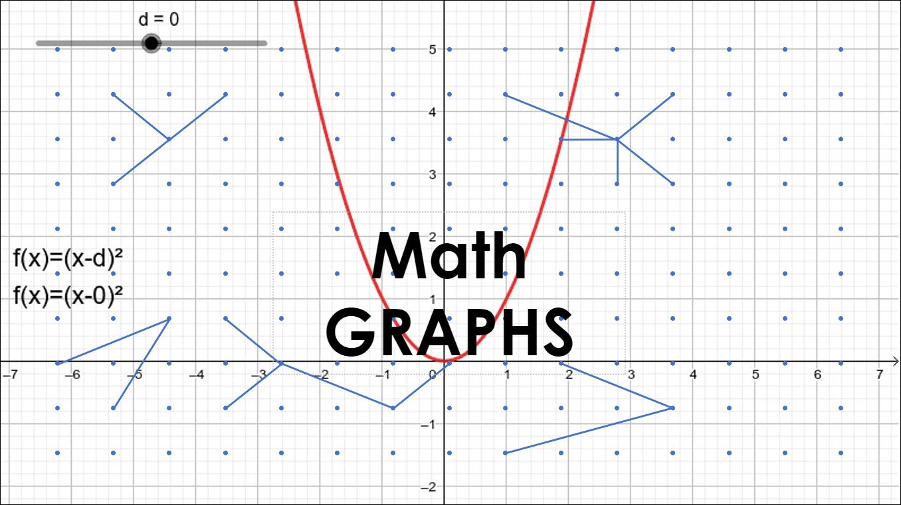

# MathGraphs

## Zieldefinition

|Ziel|Soll/Muss|
|:-|:-:|
|Ein GUI das Input entgegennehmen kann|Muss|
|Fehlerbehandlung – Überprüfen der eingegebenen Parameter|Muss|
|Das GUI soll eine skalierbare Ansicht der Graphen ermöglichen|Soll|
|Das GUI soll sich dynamisch, anhand der mathematischen Funktionen, anpassen können|Soll|
|Umsetzen folgender mathematischer Funktionen: Polynom, Exponential, Trigonometrisch|Muss|
|Umsetzen weiterer mathematischer Funktionen: z.B. Determinanten|Soll|

**Abgrenzung**: 

- Nur die reelle Zahlenebene, keine komplexen Zahlen
